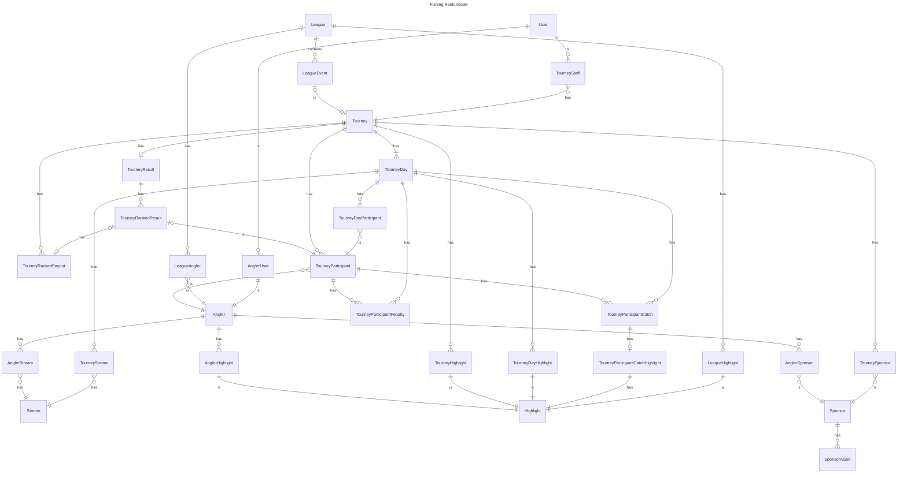

## Conventions

- **Primary keys:** every table uses a UUID primary key.
- **Enum columns (not lookup tables):** the following are modeled as enum columns on their parent entity rather than separate tables, so they don't appear as entities above:
  - `User.user_type` — `angler` | `tourney` | `admin`
  - `SponsorAsset.asset_type`
  - `TourneyParticipantCatch.catch_type`

